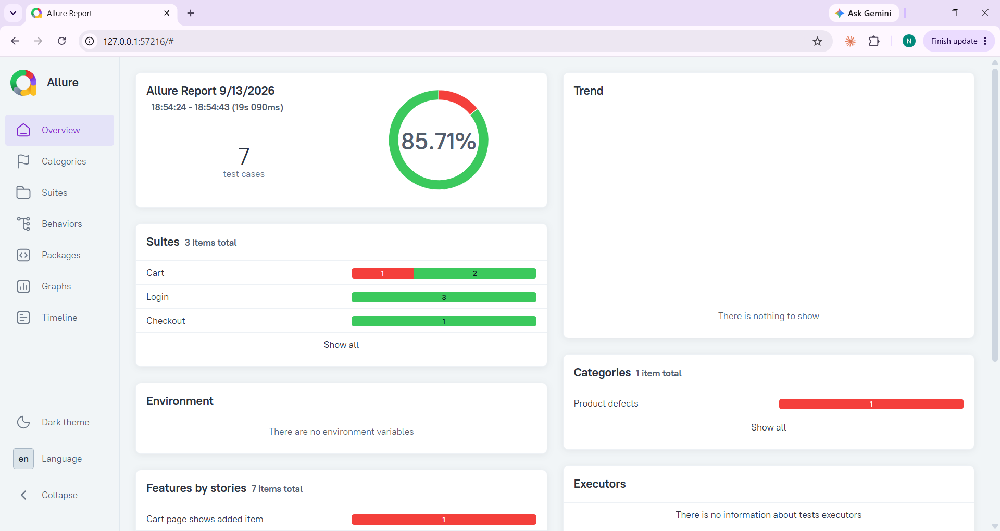
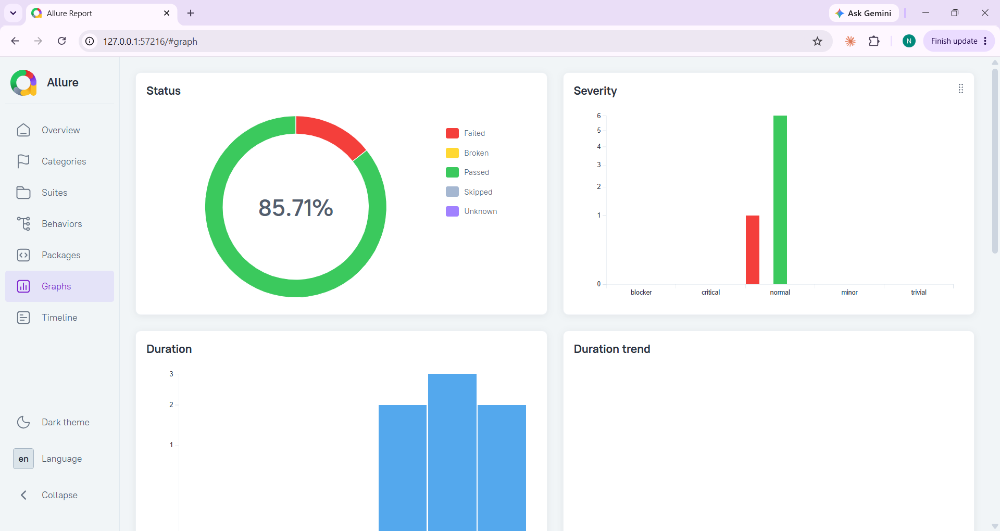
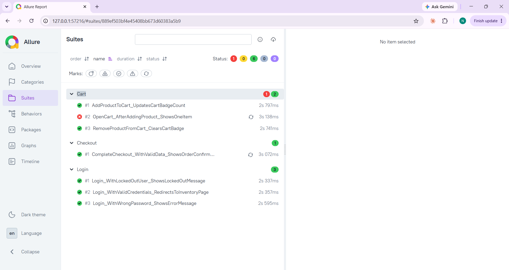

# SauceDemo UI Automation Tests

Automated UI tests for [saucedemo.com](https://www.saucedemo.com), built with C# using Selenium WebDriver and NUnit. Covers login, cart, and checkout flows, built with the Page Object Model, integrated with Allure Reports and a CI pipeline on GitHub Actions.

## Tech Stack

- **Language:** C# (.NET 8)
- **Test framework:** NUnit
- **Browser automation:** Selenium WebDriver
- **Reporting:** Allure Reports
- **CI/CD:** GitHub Actions
- **Architecture:** Page Object Model

## What's covered

- **Login:** valid credentials, invalid password, locked-out user
- **Cart:** add product, remove product, cart reflects changes
- **Checkout:** full end-to-end flow — login → add to cart → checkout → order confirmation

7 tests total, all passing automatically on every push to `main`.

## Project structure

    SauceDemoTests.UI/
    ├── Config/          — project settings (BaseUrl, read from appsettings.json)
    ├── Core/            — DriverFactory, BaseTest (setup/teardown), explicit waits
    ├── Helpers/         — screenshot capture on test failure
    ├── Pages/           — page classes: LoginPage, InventoryPage, CartPage, CheckoutPage
    ├── Tests/           — test classes: LoginTests, CartTests, CheckoutTests
    └── appsettings.json

## Key design decisions

- **No `Thread.Sleep`.** All waits are explicit (`WebDriverWait`), tied to a specific element state (visible / clickable) rather than a fixed delay.
- **Base URL is config-driven**, not hardcoded in the code.
- **Screenshot on test failure** is automatically attached to the Allure report.
- **Headless Chrome** in CI — the pipeline doesn't need a display.

## Running locally

    dotnet restore
    dotnet test

To view the Allure report locally:

    allure generate SauceDemoTests.UI/bin/Debug/net8.0/allure-results --clean -o allure-report
    allure open allure-report

## CI/CD

Every push to `main` triggers a GitHub Actions pipeline: builds the project, runs the full test suite in headless Chrome, and generates an Allure report (downloadable as a workflow artifact).

## Report screenshots

**Overview**

**Test suites**

**Test cases**

